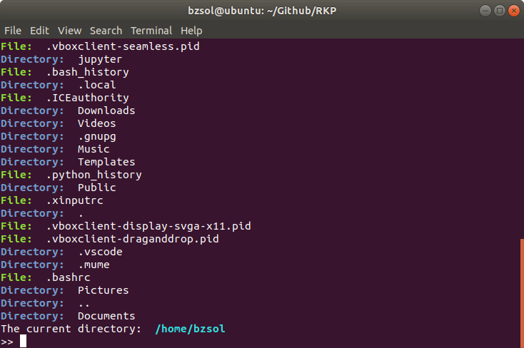

# RKP Projekt - Rendszerközeli programozás projekt feladat

###### Készítette: Berecz Zsolt - GN6W3I

#### Program leírása:

> Hozzunk létre egy olyan Linux alatt futó programot ami egy TrueColor bmp fájlban beágyazott szöveget kicsomagol és elküld egy HTTP POST segítségével egy megadott webszerverre.

#### Használandó fordító programok és kapcsolók:

A program C nyelven íródott ezért szükséges egy C fordító ez esetben a GNU Compiler Collection-t ajánlott használni.
Linux operációs rendszer esetén a telepítés terminál segítségével:

**Debian:**
`$ sudo apt-get update`
`$ sudo apt-get install gcc`

**Arch:**
`$ sudo pacman -S gcc`

**CentOS/RedHat**:
`$ sudo yum install gcc`

### Felhasználói útmutatás:

A program futtatása terminál segítségével történik ha még nem fordítottuk le a programot akkor szükséges ez esetben, ha a **program.c**-ben lévő mappában vagyunk terminál segítségével le tudjuk fordítani:

`$ gcc program.c -o program`

Több magos futattás esetén szükséges egy kapcsoló OpenMP inicializálása

`$ gcc program.c -o program -fopenmp`

`-o` kapcsoló esetén a nevét adjuk meg a futattható állománynak.

`-fopenmp` kapcsoló esetén bővítjük a programot a gcc OpenMP implementációjával.

Lefordítás után kapunk egy **.program** nevezetű futtatható állományt.
Ezt követően a következő parancsot írjuk be:

`$ ./program`

Ezt követően egy file böngészőt láthatunk:

### Fájl keresése a file böngésző segítségével:

A file böngésző nagyon hatékonyan dolgozik mivel akár csak a mappa vagy a fájl neve elég hogy keresni tudjunk a mappánkban vagy az adott .bmp fájlt megnyitni.
Ha direkt elérési útvonalat szeretnénk bátran használható ez az opció is.

**Ha vissza szeretnénk navigálni az előző mappára `/../` vagy  `..` segítségével tudunk!**

### File megnyitása parancssori argumentumként

Ha ezt az opciót szeretnénk használni egyszerűen mellé írjuk a program futtatása előtt a file nevét:
 
`$ ./program cpu.bmp`

**Fontos: A program nem zár be Ctrl+C kombináció esetén mellé ha időtúllépés lépne fel a program bezár.**

### Program által visszaadott hibakódok:

- **Hibakód: 0**: Ez esetben a program tökéletesen lefutott és egy zöld szöveg segítségével tájékoztat hogy sikeresen megtörtént a kapcsolat a szerverrel és a képből a kód hibátlanul ki lett kódolva.
  
- **Hibakód: 1**: Memóriafoglalás hiba történt,ilyen esetben érdemes megnézni mennyi szabad memóriával rendelkezünk vagy pedig a program újra fordítása adhat segítséget.
  
- **Hibakód: 2**: A megnyitott fájl nem valós TrueColor bmp file, ezért a program nem tudja a kívánt feladatot elvégezni.
  
- **Hibakód: 3**: Webszerver ahova csatlakoznánk nem elérhető vagy nem létezik.
  
- **Hibakód 4**:Hálózati csomag létrehozásakor hiba történt.
  
- **Hibakód 5**: A szerverhez való csatlakozás meghiúsult.
  
- **Hibakód 6**: A csomag (dekódolt szöveg) elküldése során hiba történt.

- **Hibakód 7**: A visszaérkező válasz szöveg nem érkezett meg és emiatt hibás a csomag küldés
  
- **Hibakód 8**: Hibás a csomag elküldése ez esetben egy HTTP hibakód érkezett.
- **Hibakód 9**: A szignál kezelés során hiba történt azaz a kódolás nem történt meg időben (ez esetben 1 másodperc).

#### RKP.h tartalma:
